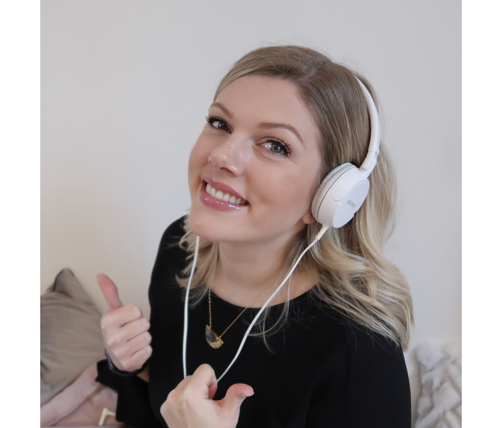
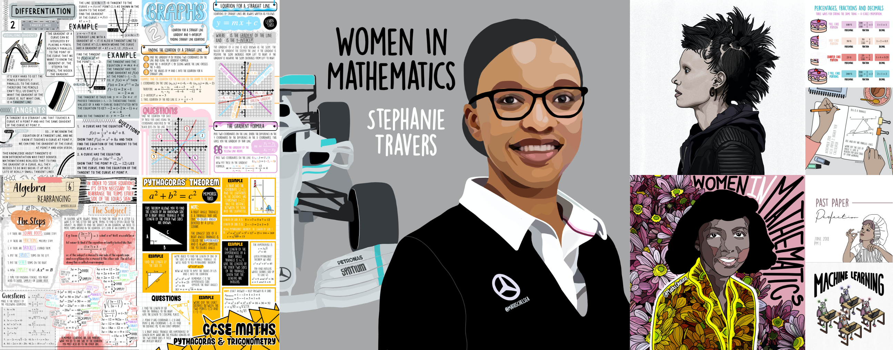

### Chelsea Tucker

A lover of all things technical, I spend my day as a Data Scientist building machine learning models that; in a nutshell, predict the future. Pretty neat. By evening I champion and promote women in STEM subjects through speaking at events and creating content on [Instagram](https://www.instagram.com/mathschelsea/), [YouTube](https://www.youtube.com/c/mathschelsea) and [TikTok](https://www.tiktok.com/@mathschelsea). I aim to ignite a belief in young people that they have what it takes to thrive in a world of numbers and computing; regardless of gender or race. I also acknowledge that not everyone is dealt the same privileges in life and so I create free visually appealing mathematical learning materials using my background in both fine art and mathematics. And I do all of this drinking copious amounts of Yorkshire tea, buying aesthetically pleasing stationary and planning holidays that revolve around longboarding, kitesurfing and general "vanlife" antics.

### Blog Mission Statement - Jerry Maguire style

These writings don't aim to impress. They are simply an account of one person's learning curve. The intention is to showcase an honest journey that is accessible to all. Too often topics like Data Science are shrouded in mystery, kept from the masses by large organisations and the highest levels of education. When learnings are shared, they usually alienate eager pupils with overly-complicated content. This suffocation of aspiration needs to end and a new wave of alternative learning needs to emerge. It's time to be kind and share our journey - the good and the bad. It's also time to be gracious and remember that all teachers were once pupils.

### MathsChelsea

The intention behind the 'MathChelsea' Instagram and Youtube account was to create a platform of freely accessible mathematical learning materials that rebel against the notion that maths is difficult, mundane and irrelevant. The result is a collection of worksheets and videos that teach technical topics through bursts of colour and unconventional contexts. In addition to learning materials, these socials also house illustrations that champion female figures in STEM who come from underprivileged or minority backgrounds.

### Bits and Bobs

